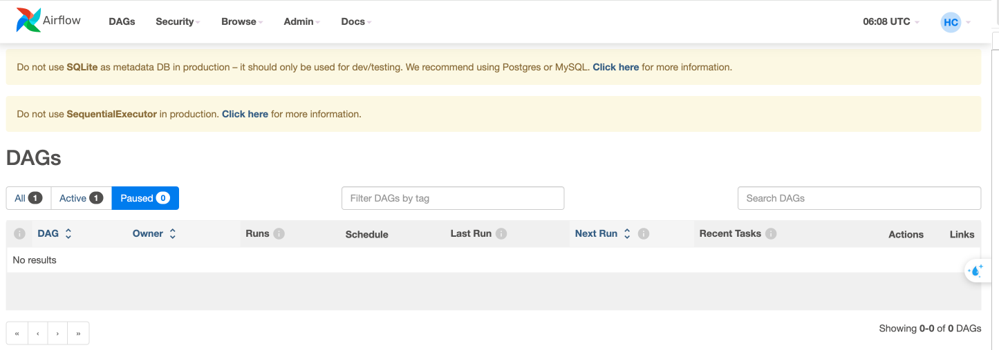
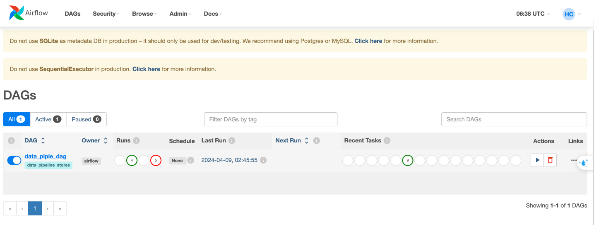
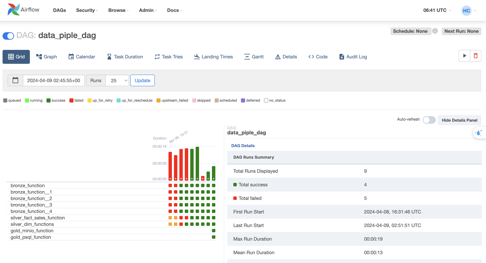
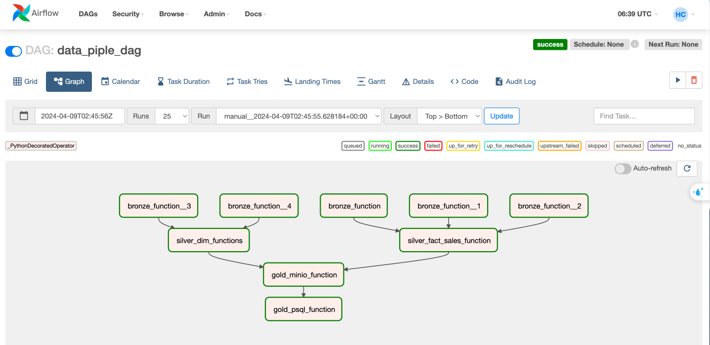
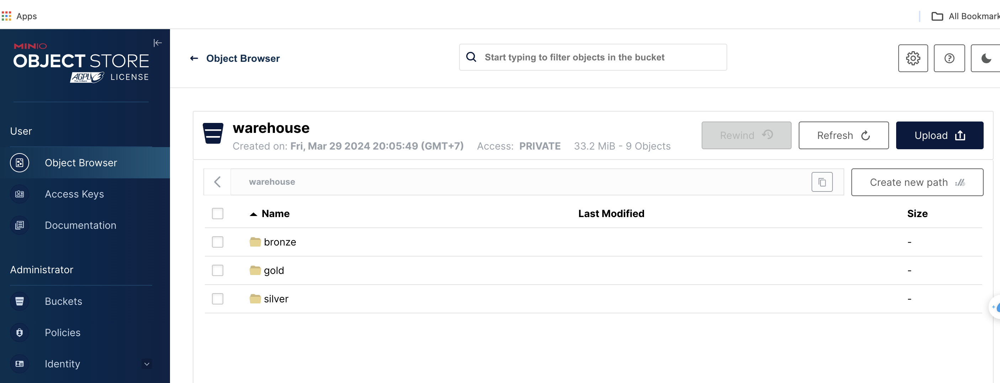

# AIRFLOW_ETL
install airflow in python env: `pip install apache-airflow==2.3.0

pip install 'apache-airflow[celery, crypto, mysql, postgres, ssh, statsd, gcp]'
`
## Tạo môi trường local
` Cài đặt môi trường python`
> python3 -m venv env_name

`Activate python env`
> source env_name/bin/activate

`Cài đặt các thư viện cần thiết từ file requirements.txt`
> pip3 install -r requirements.txt

## Airflow project
### Khởi tạo dags
1. Tạo folder `dags`
2. Tạo file elt_pipeline.py
3. tạo file requirements.txt với nội dung sau
```
pendulum==2.1.2
pydantic==1.9.0
pandas==1.5.3 
SQLAlchemy==1.4.46 
pymysql==1.0.2 
cryptography==39.0.0 
pyarrow==10.0.1 
boto3==1.26.57 
fsspec==2023.1.0 
s3fs==0.4.2
minio==7.1.13
```
### Dockerized airflow project
1. tạo Dockerfile trong folder `dags` có nội dung như sau:
```docker
FROM apache/airflow:2.3.0-python3.8

WORKDIR /opt/airflow

COPY requirements.txt .
RUN pip install -r requirements.txt
```

Vào thư mục gốc tạo docker-compose.yaml, env có nội dung sau:

**docker-compose.yaml**
```docker
version: '3.0'

services:
  de_mysql:
    image: mysql:8.0
    container_name: de_mysql
    volumes:
      - ./mysql:/var/lib/mysql
    ports:
      - "3307:3306"
    env_file:
      - env
    networks:
      - de_network

  de_psql:
    image: postgres:15 
    container_name: de_psql 
    volumes:
      - ./postgresql:/var/lib/postgresql/data 
    ports:
      - "5432:5432" 
    env_file:
      - env 
    networks:
      - de_network

  minio:
    hostname: minio
    image: "minio/minio" 
    container_name: minio 
    ports:
      - "9001:9001"
      - "9000:9000"
    command: [ "server", "/data", "--console-address", ":9001" ] 
    volumes:
      - ./minio:/data 
    env_file:
      - env 
    networks:
      - de_network
      
  mc:
    image: minio/mc 
    container_name: mc 
    hostname: mc 
    env_file:
      - env
    entrypoint: >
          /bin/sh -c " until (/usr/bin/mc config host add minio http://minio:9000 minio minio123) do echo '...waiting...' && sleep 1; done; /usr/bin/mc mb minio/warehouse; /usr/bin/mc policy set public minio/warehouse; exit 0; "
    depends_on: 
      - minio
    networks:
      - de_network

  de_airflow:
    build: 
      context: ./dags
      dockerfile: ./Dockerfile
    container_name: de_airflow
    image: de_airflow:latest
    expose:
      - "8080"
    ports:
      - "8080:8080"
    env_file:
      - env
    volumes:
      - ./dags:/opt/airflow/dags
      - ./airflow_data:/tmp
    command: bash -c '(airflow db init && airflow users create --username admin --password admin --firstname Htd --lastname Coserv --role Admin --email kl@gmail.com); airflow webserver & airflow scheduler'

    networks:
      - de_network
      
networks: 
  de_network:
    driver: bridge 
    name: de_network

volumes:
  dags:
```

**env**
```bash
# PostgreSQL 
POSTGRES_HOST=de_psql
POSTGRES_PORT=5432
POSTGRES_DB=postgres 
POSTGRES_USER=admin
POSTGRES_PASSWORD=admin123
POSTGRES_HOST_AUTH_METHOD=trust

# MySQL
MYSQL_HOST=de_mysql
MYSQL_PORT=3306 
MYSQL_DATABASE=brazillian_ecommerce 
MYSQL_ROOT_PASSWORD=admin123 
MYSQL_USER=admin 
MYSQL_PASSWORD=admin123

# MinIO 
MINIO_ENDPOINT=minio:9000 
MINIO_ROOT_USER=minio 
MINIO_ROOT_PASSWORD=minio123 
MINIO_ACCESS_KEY=minio 
MINIO_SECRET_KEY=minio123 
DATALAKE_BUCKET=warehouse 
AWS_ACCESS_KEY_ID=minio 
AWS_SECRET_ACCESS_KEY=minio123 
AWS_REGION=us-east-1
```

### Tạo Makefile để thực thi nhanh các câu lệnh thường dùng
 Tạo folder gốc tạo file Makefile với nội dung sau:

 ```makefile
 include env
build:
	docker-compose build

up:
	docker-compose --env-file env up -d

down:
	docker-compose --env-file env down

restart:
	make down && make up

to_psql: 
	docker exec -ti de_psql psql postgres://${POSTGRES_USER}:${POSTGRES_PASSWORD}@${POSTGRES_HOST}:${POSTGRES_PORT}/${POSTGRES_DB}

to_mysql:
	docker exec -it de_mysql mysql --local-infile=1 -p"${MYSQL_PASSWORD}" ${MYSQL_DATABASE}

to_mysql_root:
	docker exec -it de_mysql mysql -u"root" -p"${MYSQL_PASSWORD}" ${MYSQL_DATABASE}
 ```

 ### Chạy các lệnh sau để build images và khởi tạo các services

 ```bash
 # build and run services
make build
make up
# check running services
docker ps
# kết quả sau khi chạy docker ps
CONTAINER ID   IMAGE               COMMAND                  CREATED      STATUS      PORTS                               NAMES
3dd5e33b10bf   postgres:15         "docker-entrypoint.s…"   8 days ago   Up 8 days   0.0.0.0:5432->5432/tcp              de_psql
8d0252bbdccd   minio/minio         "/usr/bin/docker-ent…"   8 days ago   Up 8 days   0.0.0.0:9000-9001->9000-9001/tcp    minio
3dcd28ff9022   de_airflow:latest   "/usr/bin/dumb-init …"   8 days ago   Up 8 days   0.0.0.0:8080->8080/tcp              de_airflow
26ce18c5f949   mysql:8.0           "docker-entrypoint.s…"   8 days ago   Up 8 days   33060/tcp, 0.0.0.0:3307->3306/tcp   de_mysql
 ```
 Nếu muốn stop các services có thể sử dụng lệnh sau của makefile(hiện tại thì vấn để các services tiếp tục running)
 > make down

 Truy cập vào [http://localhost:8080/](http://localhost:8080)
 

 ## Chuẩn bị dữ liệu cho MýQL
 Tạo **mysql_schemas.sql** script có nội dung như bên dưới:
 ```sql
DROP TABLE IF EXISTS product_category_name_translation;
CREATE TABLE product_category_name_translation ( 
    product_category_name varchar(64), 
    product_category_name_english varchar(64), 
    PRIMARY KEY (product_category_name)
);

DROP TABLE IF EXISTS olist_products_dataset; 
CREATE TABLE olist_products_dataset (
    product_id varchar(32), 
    product_category_name varchar(64), 
    product_name_lenght int4, 
    product_description_lenght int4, 
    product_photos_qty int4, 
    product_weight_g int4, 
    product_length_cm int4, 
    product_height_cm int4, 
    product_width_cm int4,
    PRIMARY KEY (product_id)
);

DROP TABLE IF EXISTS olist_orders_dataset; 
CREATE TABLE olist_orders_dataset (
    order_id varchar(32),
    customer_id varchar(32),
    order_status varchar(16), 
    order_purchase_timestamp varchar(32), 
    order_approved_at varchar(32), 
    order_delivered_carrier_date varchar(32), 
    order_delivered_customer_date varchar(32), 
    order_estimated_delivery_date varchar(32), 
    PRIMARY KEY(order_id)
);

DROP TABLE IF EXISTS olist_order_items_dataset; 
CREATE TABLE olist_order_items_dataset (
    order_id varchar(32), 
    order_item_id int4,
    product_id varchar(32), 
    seller_id varchar(32), 
    shipping_limit_date varchar(32), 
    price float4,
    freight_value float4,
    created_at TIMESTAMP DEFAULT NOW(),
    updated_at TIMESTAMP DEFAULT NOW(),
    PRIMARY KEY (order_id, order_item_id, product_id, seller_id),
    FOREIGN KEY (order_id) REFERENCES olist_orders_dataset(order_id), 
    FOREIGN KEY (product_id) REFERENCES olist_products_dataset(product_id)
);

DROP TABLE IF EXISTS olist_order_payments_dataset; 
CREATE TABLE olist_order_payments_dataset (
    order_id varchar(32),
    payment_sequential int4,
    payment_type varchar(16), 
    payment_installments int4,
    payment_value float4,
    PRIMARY KEY (order_id, payment_sequential)
);
 ```

 Thiết lập MýQL server hỗ trợ nạp dữ liệu từ file csv (folder **brazilian-ecommerce** là csv file sau khi download từ Kaggle)

 ```bash
 # copy CSV data to mysql container
# cd path/to/brazilian-ecommerce/
docker cp brazilian-ecommerce/ de_mysql:/tmp/
docker cp mysql_schemas.sql de_mysql:/tmp/
# login to mysql server as root
make to_mysql_root
SHOW GLOBAL VARIABLES LIKE 'LOCAL_INFILE';
SET GLOBAL LOCAL_INFILE=TRUE;
exit
 ```

 Tạo schema và nạp dữ liệu vào tables

 ```bash
 # run commands
make to_mysql

source /tmp/mysql_schemas.sql;
show tables;

LOAD DATA LOCAL INFILE '/tmp/brazilian-ecommerce/olist_order_items_dataset.csv' INTO TABLE olist_order_items_dataset FIELDS TERMINATED BY ',' LINES TERMINATED BY '\n' IGNORE 1 ROWS;

LOAD DATA LOCAL INFILE '/tmp/brazilian-ecommerce/olist_order_payments_dataset.csv' INTO TABLE olist_order_payments_dataset FIELDS TERMINATED BY ',' LINES TERMINATED BY '\n' IGNORE 1 ROWS;

LOAD DATA LOCAL INFILE '/tmp/brazilian-ecommerce/olist_orders_dataset.csv' INTO TABLE olist_orders_dataset FIELDS TERMINATED BY ',' LINES TERMINATED BY '\n' IGNORE 1 ROWS;

LOAD DATA LOCAL INFILE '/tmp/brazilian-ecommerce/olist_products_dataset.csv' INTO TABLE olist_products_dataset FIELDS TERMINATED BY ',' LINES TERMINATED BY '\n' IGNORE 1 ROWS;

LOAD DATA LOCAL INFILE '/tmp/brazilian-ecommerce/product_category_name_translation.csv' INTO TABLE product_category_name_translation FIELDS TERMINATED BY ',' LINES TERMINATED BY '\n' IGNORE 1 ROWS;

# check tables records
SELECT * FROM olist_order_items_dataset LIMIT 10;
SELECT * FROM olist_order_payments_dataset LIMIT 10; SELECT * FROM olist_orders_dataset LIMIT 10;
SELECT * FROM olist_products_dataset LIMIT 10;
SELECT * FROM product_category_name_translation LIMIT 10;
 ```

 Tạo table tương tự cho PostgreSQL

 ```bash
 CREATE TABLE public.olist_orders_dataset ( order_id text NULL,
    customer_id text NULL,
    order_status text NULL, 
    order_purchase_timestamp text NULL, 
    order_approved_at text NULL, 
    order_delivered_carrier_date text NULL, 
    order_delivered_customer_date text NULL, 
    order_estimated_delivery_date text NULL
);
 ```
 ## ETL pipeline

 Chuẩn bị files và folders như bên dưới

 - dags

    - assets
        - [bronze_layer.py](./dags/assets/bronze_layer.py)
        - [gold_layer.py](./dags/assets/gold_layer.py)
        - [silver_layer.py](./dags/assets/silver_layer.py)
    - resources
        - [minio_io_manager.py](./dags/resources/minio_io_manager.py)
        - [mysql_io_manager.py](./dags/resources/mysql_io_manager.py)
        - [psql_io_manager.py](./dags/resources/psql_io_manager.py)
    - [Dockerfile](./dags/Dockerfile)
    - [etl_pipeline.py](./dags/etl_pipeline.py)
    - [requirements.txt](./dags/requirements.txt)

Xây dựng các IOManager trong folder reqources
- **minio_io_manager.py**
```python
import os
from contextlib import contextmanager 
from datetime import datetime

import pandas as pd
import pyarrow as pa
import pyarrow.parquet as pq
from minio import Minio


@contextmanager
def connect_minio(config):
    client = Minio(
        endpoint=config.get("endpoint_url"), 
        access_key=config.get("aws_access_key_id"),
        secret_key=config.get("aws_secret_access_key"),
        secure=False, 
        )
    try:
        yield client
    except Exception:
        raise

class MinIOIOManager():
    def __init__(self, config):
        self._config = config

    def _get_path(self, context):
        layer =  context["layer"]
        schema = context["schema"]
        table = context["table"]
        key = "/".join([layer, schema, table.replace(f"{layer}_", "")])
        tmp_file_path = "/tmp/file-{}-{}.parquet".format(
            datetime.today().strftime("%Y%m%d%H%M%S"), "-".join([layer, schema, table])
        )
        return f"{key}.pq", tmp_file_path
    
    def handle_output(self, context, obj):
        key_name, tmp_file_path = self._get_path(context)
        table = pa.Table.from_pandas(obj)
        pq.write_table(table, tmp_file_path)

        try:
            bucket_name = self._config.get("bucket")
            with connect_minio(self._config) as client:
                found = client.bucket_exists(bucket_name)
                if not found:
                    client.make_bucket(bucket_name)
                else:
                    print(f"Bucket {bucket_name} already exists")
                client.fput_object(bucket_name, key_name, tmp_file_path)
                row_count = len(obj)
                os.remove(tmp_file_path)
                return {
                    "path": key_name,
                    "tmp": tmp_file_path
                }
                          
        except Exception:
            raise 
    
    def load_input(self, context):
        bucket_name = self._config.get("bucket")
        key_name, tmp_file_path = self._get_path(context)
        try:
            with connect_minio(self._config) as client:
                found = client.bucket_exists(bucket_name)
                if not found:
                    client.make_bucket(bucket_name)
                else:
                    print(f"Bucket {bucket_name} already exists")
                client.fget_object(bucket_name, key_name, tmp_file_path)
                pd_data = pd.read_parquet(tmp_file_path)
                return pd_data
        except Exception:
            raise
```

- **mysql_io_manager.py**
```python
from contextlib import contextmanager

import pandas as pd
from sqlalchemy import create_engine

@contextmanager
def connect_mysql(config):
    conn_info = (
        f"mysql+pymysql://{config['user']}:{config['password']}" 
        + f"@{config['host']}:{config['port']}"
        + f"/{config['database']}"
    )
    db_conn = create_engine(conn_info) 
    try:
        yield db_conn 
    except Exception:
        raise

class MySQLIOManager(): 
    def __init__(self, config):
        self._config = config

    def handle_output(self):
        pass

    def load_input(self):
        pass
    
    def extract_data(self, sql: str): 
        with connect_mysql(self._config) as db_conn:
            pd_data = pd.read_sql_query(sql, db_conn) 
            return pd_data
```

- **psql_io_manager.py**
```python
from contextlib import contextmanager 
from datetime import datetime

import pandas as pd
from sqlalchemy import create_engine

@contextmanager
def connect_psql(config): 
    conn_info = (
        f"postgresql+psycopg2://{config['user']}:{config['password']}" 
        + f"@{config['host']}:{config['port']}"
        + f"/{config['database']}"
    )

    db_conn = create_engine(conn_info) 
    try:
        yield db_conn 
    except Exception:
        raise
    
class PostgreSQLIOManager(): 
    def __init__(self, config):
        self._config = config

    def load_input(self, context) -> pd.DataFrame:
        pass

    def handle_output(self, context, obj: pd.DataFrame):
        schema = context["schema"]
        table = context["table"]
        with connect_psql(self._config) as conn:
           # insert new data
            ls_columns = context.get("columns", [])
            obj[ls_columns].to_sql( 
                name=f"{table}",
                con=conn,
                schema=schema,
                if_exists="replace", 
                index=False, 
                chunksize=10000, 
                method="multi",
            )
```

Xây dựng các class cho từng layer trong folder assets
- **bronze_layer.py**
```python
from resources.minio_io_manager import MinIOIOManager
from resources.mysql_io_manager import MySQLIOManager


import os
import pandas as pd

class BronzeLayer:
    def __init__(self, mysql_io_manager, minio_io_manager):
        self.mysql_io_manager = mysql_io_manager
        self.minio_io_manager = minio_io_manager

    def get_data_from_mysql(self, dataset_name):
        sql_stm = f"SELECT * FROM {dataset_name}"
        pd_data = self.mysql_io_manager.extract_data(sql_stm)
        tmp_file_path = f'/tmp/bronze_{dataset_name}.csv'
        pd_data.to_csv(tmp_file_path, index=False)
        return pd_data
    
    def transform_and_load_to_minio(self, object, context):
        # context = {
        #     "layer": "bronze",
        #     "schema": "public",
        #     "table": "item_order"
        # }
        self.minio_io_manager.handle_output(context, object)
```

- **silver_layer.py**
```python
class SilverLayer():
    def __init__(self, minio_io_manager):
        self.minio_io_manager = minio_io_manager

    def dim_products(self, bronze_olist_products_dataset, bronze_product_category_name_traslations, context):
        pd_dim_products = bronze_olist_products_dataset.merge(
            bronze_product_category_name_traslations, on = "product_category_name"
            )
        pd_dim_products = pd_dim_products[["product_id", "product_category_name_english"]]

        self.minio_io_manager.handle_output(context, pd_dim_products)
        return pd_dim_products
    def fact_sales(self, bronze_olist_orders_dataset, bronze_olist_order_items_dataset, bronze_olist_order_payments_dataset, context):

        pd_fact_sales = bronze_olist_orders_dataset.merge(
            bronze_olist_order_items_dataset, on = "order_id"
            ).merge(bronze_olist_order_payments_dataset, on = "order_id")
        
        select_columns = [
            "order_id",
            "customer_id",
            "order_purchase_timestamp",
            "product_id",
            "payment_value",
            "order_status",
        ]
        pd_fact_sales = pd_fact_sales[select_columns]

        self.minio_io_manager.handle_output(context, pd_fact_sales)
        return pd_fact_sales
```

- **gold_layer.py**
```python
class GoldLayer():
    def __init__(self, minio_io_manager):
        self.minio_io_manager = minio_io_manager
        self.context = {
                "layer": "gold",
                "schema": "ecom",
                "table": "gold_sales_value_by_category"
            }
    
    def gold_sales_value_by_category(self, fact_sales, dim_products):
        fact_sales["order_purchase_timstamp"] = fact_sales[
            "order_purchase_timestamp"
        ].apply(lambda x: x.split()[0])

        daily_sales_products = (
            fact_sales.query("order_status == 'delivered'")
            .groupby(["order_purchase_timestamp", "product_id"])
            .agg({"payment_value": "sum", "order_id":"unique"})
            .reset_index()
        )

        monthly_sales_categories = daily_sales_products.merge(dim_products, on="product_id")
        monthly_sales_categories["monthly"] = monthly_sales_categories[
            "order_purchase_timestamp"
        ].apply(lambda x: x[:-2] +"01")

        sales = (
            monthly_sales_categories.groupby(["monthly", "product_category_name_english"])
            .agg({"payment_value":"sum", "order_id": "count"})
            .reset_index()
            .rename(
                columns={
                    "product_category_name_english": "category",
                    "payment_value": "sales",
                    "order_id": "bills",
                }
            )
        )
        sales["value_per_bill"] = sales["sales"]/ sales["bills"]
        

        self.minio_io_manager.handle_output(self.context, sales)

        return self.context

```

Khởi tạo `@dag` và `@task` liên quan trong etl_pipeline.py

```python
from airflow import DAG

from datetime import datetime

from airflow.operators.python import PythonOperator
from airflow.decorators import dag, task

# from mysql_io_manager import MySQLIOManager
from resources.minio_io_manager import MinIOIOManager
from resources.mysql_io_manager import MySQLIOManager
from resources.psql_io_manager import PostgreSQLIOManager

from assets.bronze_layer import BronzeLayer
from assets.silver_layer import SilverLayer
from assets.gold_layer import GoldLayer

import os

import pandas as pd


MYSQL_CONFIG = {
    "host": os.getenv("MYSQL_HOST"),
    "port": os.getenv("MYSQL_PORT"), 
    "database": os.getenv("MYSQL_DATABASE"), 
    "user": os.getenv("MYSQL_USER"), 
    "password": os.getenv("MYSQL_PASSWORD"),
}

MINIO_CONFIG = {
    "endpoint_url": os.getenv("MINIO_ENDPOINT"),
    "bucket": os.getenv("DATALAKE_BUCKET"),
    "aws_access_key_id": os.getenv("AWS_ACCESS_KEY_ID"), 
    "aws_secret_access_key": os.getenv("AWS_SECRET_ACCESS_KEY"),
}

PSQL_CONFIG = {
    "host": os.getenv("POSTGRES_HOST"),
    "port": os.getenv("POSTGRES_PORT"), 
    "database": os.getenv("POSTGRES_DB"), 
    "user": os.getenv("POSTGRES_USER"), 
    "password": os.getenv("POSTGRES_PASSWORD"),
}

mysql_io_manager = MySQLIOManager(MYSQL_CONFIG)
minio_io_manager = MinIOIOManager(MINIO_CONFIG)
psql_io_manager = PostgreSQLIOManager(PSQL_CONFIG)

bronze_layer = BronzeLayer(mysql_io_manager, minio_io_manager)
silver_layer = SilverLayer(minio_io_manager)
gold_layer = GoldLayer(minio_io_manager)

ls_tables = [
    "olist_order_items_dataset",
    "olist_order_payments_dataset",
    "olist_orders_dataset",
    "olist_products_dataset",
    "product_category_name_translation",
]

@dag(
    schedule_interval = None,
    start_date = datetime(2024, 4,7),
    tags = ["data_pipeline_stores"]
)
def data_piple_dag():

    @task
    def bronze_get_df_functions(dataset_name):
        return {"a":bronze_layer.get_data_from_mysql(dataset_name)}
    
    @task
    def bronze_transform_load_functions(df, dataset_name):
        context = {
                "layer": "bronze",
                "schema": "ecom",
                "table": dataset_name
            }
        bronze_layer.transform_and_load_to_minio(df, context)
        return context

    @task 
    def bronze_function(dataset_name):
        df = bronze_layer.get_data_from_mysql(dataset_name)
        context = {
                "layer": "bronze",
                "schema": "ecom",
                "table": dataset_name
            }
        bronze_layer.transform_and_load_to_minio(df, context)
        return context
    bronze_context_list = {}
    for dataset_name in ls_tables:
        bronze_context = bronze_function(dataset_name)
        bronze_context_list[f"{dataset_name}"] = bronze_context

    @task
    def silver_dim_functions(olist_products_dataset_context, product_category_name_translation_context):
        olist_products_dataset = minio_io_manager.load_input(olist_products_dataset_context)
        product_category_name_translation = minio_io_manager.load_input(product_category_name_translation_context)
        context = {
                "layer": "silver",
                "schema": "ecom",
                "table": "dim_products"
            }
        silver_layer.dim_products(olist_products_dataset, product_category_name_translation, context)
        return context
    
    @task
    def silver_fact_sales_function(olist_orders_dataset_context, olist_order_items_dataset_context, olist_order_payments_dataset_context):
        bronze_olist_orders_dataset = minio_io_manager.load_input(olist_orders_dataset_context)
        bronze_olist_order_items_dataset = minio_io_manager.load_input(olist_order_items_dataset_context)
        bronze_olist_order_payments_dataset = minio_io_manager.load_input(olist_order_payments_dataset_context)
        context = {
                "layer": "silver",
                "schema": "ecom",
                "table": "fact_sales"
            }
        silver_layer.fact_sales(bronze_olist_orders_dataset, bronze_olist_order_items_dataset, bronze_olist_order_payments_dataset, context)
        return context

    @task
    def gold_minio_function(fact_sales_context, dim_products_context):
        fact_sales = minio_io_manager.load_input(fact_sales_context)
        dim_products = minio_io_manager.load_input(dim_products_context)

        context = gold_layer.gold_sales_value_by_category(fact_sales, dim_products)

        return context
    
    @task
    def gold_psql_function(gold_sales_context):
        sales_values_df = minio_io_manager.load_input(gold_sales_context)
        context = {
            "schema": "gold",
            "table": "sales_values_by_category",
            "columns": sales_values_df.columns
        }
        psql_io_manager.handle_output(context, sales_values_df)


    silver_fact_sales_context = silver_fact_sales_function(bronze_context_list["olist_orders_dataset"],
                                                    bronze_context_list["olist_order_items_dataset"],
                                                    bronze_context_list["olist_order_payments_dataset"])
    
    silver_dim_products_context = silver_dim_functions(bronze_context_list["olist_products_dataset"], 
                                                bronze_context_list["product_category_name_translation"])
    
    gold_sales_context = gold_minio_function(silver_fact_sales_context, silver_dim_products_context)
    gold_psql_function(gold_sales_context)
    
data_pipeline_stores = data_piple_dag()
```

Chạy các lệnh bênh dưới để build images và khởi tạo lại containers
```bash
# stop services
make down
# build and run services
make build
make up
```

 Truy cập vào [http://localhost:8080/](http://localhost:8080)
 
 
 

 Bấm RUN button và chọn Trigger DAG để chạy datapipeline

 ### Kiểm tra Minio Folders
 
 Truy cập vào; [http://localhost:9000/](http://localhost:9000) và đăng nhập với tài khoản được khai báo ở file **env** (username: minio, pass: minio123)

 
